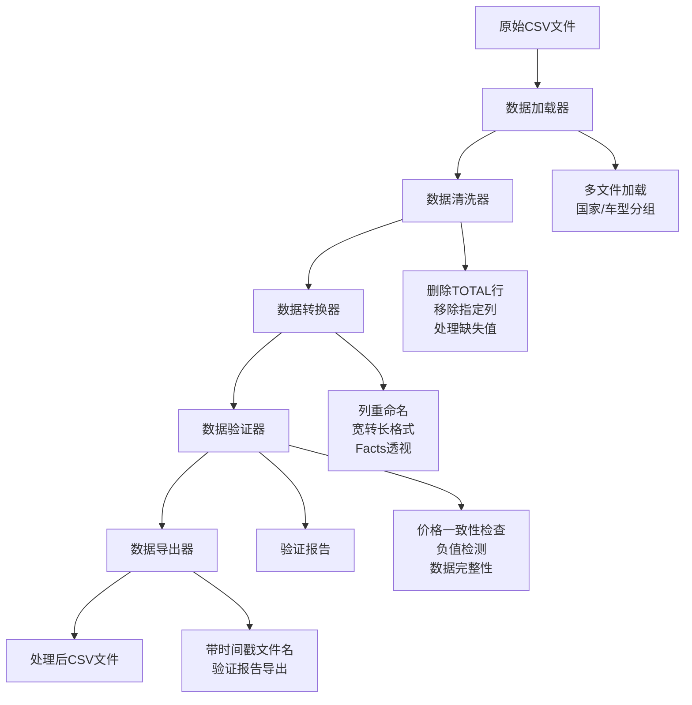

# GFK PCR Tyre ETL - GFK PCR轮胎市场数据处理库

[](https://python.org)
[](LICENSE)
[](https://gfk.com)
[]()

专业的GFK PCR轮胎市场数据ETL处理库，专门用于处理2025年欧洲汽车轮胎市场CSV数据。该库将原本混乱的数据处理脚本重构为模块化、可维护、易于使用的Python库。

## ✨ 特性

- 🏗️ **模块化设计**: 清晰分离的数据加载、清洗、转换、验证和导出模块
- ⚙️ **配置驱动**: 使用YAML配置文件管理所有参数，无硬编码
- 🔍 **数据质量**: 内置数据验证和质量检查，包括价格一致性验证
- 📊 **PCR轮胎专用**: 专门针对GFK PCR轮胎市场数据优化，支持欧洲多国数据处理
- 📅 **2025年数据**: 专门处理2025年CSV数据格式和结构
- 📁 **标准化输出**: 统一的文件命名和格式，带时间戳的输出文件
- 🧪 **完整测试**: 包含单元测试，确保代码质量
- 📖 **详细文档**: 完整的API文档和使用示例

## 🚀 快速开始

### 安装依赖

```bash
pip install -r requirements.txt
```

### 基本使用

```python
from gfk_etl_library import GFKDataPipeline

# 处理欧洲数据
pipeline = GFKDataPipeline('config/europe_config.yml')
results = pipeline.run()

# 检查结果
if results['success']:
    print(f"处理完成! 最终数据: {len(results['final_data'])} 行")
    print(f"输出文件: {results['export_results']['data']}")
```

### 命令行使用

```bash
# 处理欧洲7国PCR轮胎数据
python main.py --config config/europe_config.yml

# 处理西班牙PCR轮胎数据
python main.py --config config/spain_config.yml

# 查看可用配置
python main.py --list-configs

# 只验证不导出
python main.py --config config/europe_config.yml --no-export

# 或使用安装后的命令行工具
gfk-pcr-etl --config config/europe_config.yml
```

## 📊 数据处理流程



## 📁 项目结构

```
gfk_etl_library/
├── gfk_etl_library/           # 主库目录
│   ├── __init__.py           # 包接口
│   ├── pipeline.py           # 核心Pipeline类
│   ├── config.py             # 配置管理器
│   ├── utils.py              # 工具函数
│   └── core/                 # 核心处理模块
│       ├── loader.py         # 数据加载器
│       ├── cleaner.py        # 数据清洗器
│       ├── transformer.py    # 数据转换器
│       ├── validator.py      # 数据验证器
│       └── exporter.py       # 数据导出器
├── config/                   # 配置文件
│   ├── default_config.yml    # 默认配置
│   ├── europe_config.yml     # 欧洲数据配置
│   └── spain_config.yml      # 西班牙数据配置
├── examples/                 # 使用示例
│   ├── process_europe.py     # 欧洲数据示例
│   ├── process_spain.py      # 西班牙数据示例
│   └── custom_pipeline.py    # 自定义管道示例
├── tests/                    # 测试文件
├── data/                     # 数据目录
│   ├── processed/            # 处理后数据
│   └── reports/              # 验证报告
├── main.py                   # 主执行文件
├── requirements.txt          # Python依赖
└── README.md                 # 项目文档
```

## ⚙️ 配置文件

### 欧洲数据配置示例 (config/europe_config.yml)

```yaml
data_sources:
  region: "EUROPE"
  countries:
    Germany:
      code: "DE"
      file: "GFK_FLATFILE_CARTIRE_EUROPE_DE_SAILUN_Jun25_cleaned.csv"
    Spain:
      code: "ES"
      file: "GFK_FLATFILE_CARTIRE_EUROPE_ES_SAILUN_Jun25_cleaned.csv"
    # ... 其他国家

processing:
  cleaning:
    remove_total_rows: true
    total_patterns: ["\\.TOTAL", "^TOTAL$"]
    columns_to_drop: ["MAT JUN 24", "MAT JUN 25"]
  
  column_mapping:
    "DIMENSION (Car Tires)": "Dimension"
    "LoadIndex": "Load Index"
    # ... 其他映射

validation:
  consistency_check:
    enabled: true
    tolerance: 0.01
```

## 🔍 数据验证功能

库内置了完善的数据质量检查：

1. **价格一致性验证**: 检查 `Price EUR × Units = Value EUR`
2. **负值检测**: 识别可能的异常负值数据
3. **缺失值统计**: 详细的缺失值分析
4. **数据完整性**: 重复行、空行检测
5. **数据类型验证**: 自动类型检查和建议

### 验证报告示例

```
===============================================================
 数据验证报告 - EUROPE最终数据
===============================================================
数据行数: 156,789
数据列数: 12
整体状态: ✅ 通过

价格一致性:
  检查行数: 145,234
  一致行数: 138,567
  一致性比例: 95.41%

负值检查:
  负值行数: 23
  SALES UNITS: 15 个负值 (0.01%)
  PRICE EUR: 8 个负值 (0.01%)
```

## 📈 性能特点

- **内存优化**: 分块处理大文件，避免内存溢出
- **并行处理**: 多文件同时加载和处理
- **进度跟踪**: 实时显示处理进度
- **错误处理**: 完善的异常捕获和错误报告

## 🧪 测试

运行单元测试：

```bash
pytest tests/
```

运行特定测试：

```bash
pytest tests/test_cleaner.py -v
```

## 📚 API参考

### GFKDataPipeline

主要的管道类，协调所有处理步骤。

```python
pipeline = GFKDataPipeline(config_path: str)
results = pipeline.run(export_data=True, export_validation=True)
```

### 核心模块

- **DataLoader**: 数据加载和文件管理
- **DataCleaner**: 数据清洗和质量预处理
- **DataTransformer**: 数据格式转换和重塑
- **DataValidator**: 数据质量验证和检查
- **DataExporter**: 数据导出和报告生成

## 🔄 迁移指南

从原始脚本迁移到新库：

| 原始脚本 | 新方法 |
|---------|--------|
| `process_european_data.py` | `python main.py --config config/europe_config.yml` |
| `process_spain_data.py` | `python main.py --config config/spain_config.yml` |
| `verify_calculation.py` | 内置验证器自动执行 |
| 硬编码文件路径 | 配置文件管理 |
| 重复代码逻辑 | 统一管道处理 |

## 🤝 贡献

1. Fork 项目
2. 创建功能分支 (`git checkout -b feature/amazing-feature`)
3. 提交更改 (`git commit -m 'Add amazing feature'`)
4. 推送到分支 (`git push origin feature/amazing-feature`)
5. 开启 Pull Request

## 📝 更新日志

### v2.0.0 (重构版本)
- ✨ 完全重构为模块化库
- ⚙️ 配置文件驱动的设计
- 🔍 内置数据质量验证
- 📊 标准化的输出格式
- 🧪 完整的测试覆盖
- 📖 详细的文档和示例

### v1.0.0 (原始版本)
- 🎯 基本的数据处理功能
- 📁 单文件脚本实现

## 📞 支持

如果您遇到问题或有改进建议，请：

1. 查看[文档](docs/)
2. 搜索现有的[Issues](issues)
3. 创建新的Issue描述问题

## 👨‍💻 作者

**Julian Luan** - 市场智能专员

- 邮箱: julian.luan@sailun-tyres.eu
- GitHub: [@julianluan](https://github.com/julianluan)
- 公司: Sailun Tyres Europe

## 📄 许可证

本项目采用 MIT 许可证 - 查看 [LICENSE](LICENSE) 文件了解详情。

---

> 💡 **提示**: 这个库是从原始的数据处理脚本重构而来，保持了所有原有功能的同时，大大提升了代码的可维护性和可扩展性。
